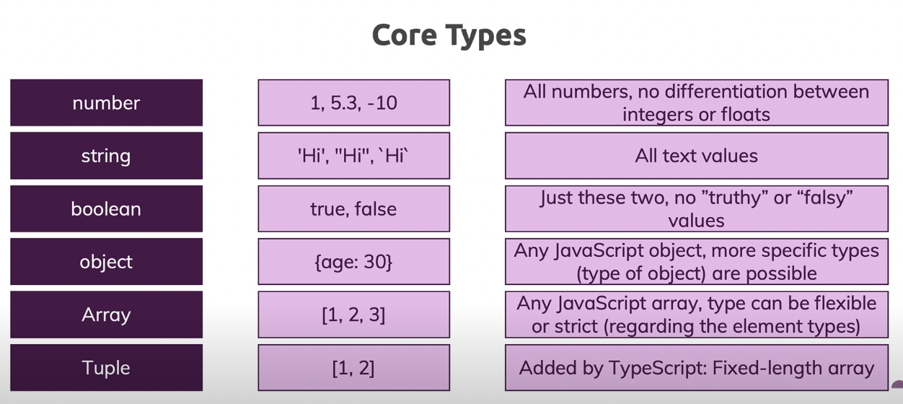

# My_Learning-Typescript

My Learning on Typescript programming language

## About

* [What is Typescript](https://www.youtube.com/watch?v=BwuLxPH8IDs&t=117s)


* [Why Typescript](https://www.youtube.com/watch?v=BwuLxPH8IDs&t=295s)


* Browsers can't execute TypeScript, but JavaScript, hence all the `.ts` code has to be compiled down to `.js`
* TypeScript is a typed superset of JavaScript that compiles to plain JavaScript.
* It offers classes, modules, and interfaces to help you build robust components.
* The compiler is `tsc`. This is used to transpile `.ts` file to `.js`
* Types

* In TypeScript, the code can be made to look like without defining specific type like JS by declaring variables as `any`.
* The idea is to throw unexpected error at compile-time not during run-time.
* Prefer using `===` instead of `==` in typescript.
  - `===` checks the types of both sides first & then the value. In TS, `==` would also work in similar way.
  - `==` sometimes might give an unexpected result. 
  
So, it's better to use `===` than `==` in TS.

E.g.

```console
let str = "1";
let num = 1;

console.log(str == num);
```

After compile,

```console
comparisons.ts:4:13 - error TS2367: This condition will always return 'false' since the types 'string' and 'number' have no overlap.

4 console.log(str == num);
              ~~~~~~~~~~

Found 1 error.
```

Hence, it's not wrong to use `==`. But, still for safety use `===` over `==` 

## Installation

### Ubuntu

* M-1

```console
// globally
$ npm install -g typescript

// locally
$ npm install --save-dev typescript
```

* M-2

```console
$ sudo apt get update

$ sudo apt install node-typescript
```

### MacOS

#### Install

```console
// globally
$ npm install -g typescript

// locally
$ npm install --save-dev typescript
```

#### Update

```console
$ npm update -g typscript
```

#### Uninstall

```console
// globally
$ npm uninstall -g typescript

// locally
$ npm uninstall --save-dev typescript
```

## Getting Started

### Windows

#### Write code

```ts
let h = "Hello World"
console.log(h);
```

#### Transpile code

```console
$ ts hello.ts
// generates a `hello.js` file

// M-2
$ ts hello.ts --outFile hello
// generates a `hello` file
```

#### Print code

```console
$ npm hello.js

// OR

$ npm hello
```

### MacOS

#### Write code

```ts
let h = "Hello World"
console.log(h);
```
#### Transpile code

```console
$ tsc hello.ts
// generates a `hello.js` file

// M-2
$ tsc hello.ts --outFile hello
// generates a `hello` file
```

#### Print code

```console
$ node hello.js

// OR

$ node hello
```

## Learning

* For React, JS is used which is achieved by compiling typescript. Hence, a safer JS rather than hardcoding JS w/o static typing.
* [understanding typescript](./tuts/understanding-ts/README.md)

## Troubleshooting

### Error: `error TS2304: Cannot find name 'unknown'.`

* Solution:

```ts
declare global {
  type unknown = any
}
```

### Error: `Not able to print Promise <pending> result`

* Before:

```ts
const eoslime = require('eoslime');

// a promise pending funciton
const randomName = eoslime.utils.randomName();
console.log("Random name: " + randomName);		// => Random name: [object Promise]
```

* Reason: The promise will always log pending as long as its results are not resolved yet. You must call .then on the promise to capture the results regardless of the promise state (resolved or still pending) [source](https://stackoverflow.com/a/38884856/6774636).
* After:

```ts
const eoslime = require('eoslime');

// a promise pending funciton
const randomName = eoslime.utils.randomName();
randomName.then(function(result){
  console.log("Random name: " + result);   // => Random name: lfb3a45e344e
})
```

## Repositories

* TS Unit Tests Setup - https://github.com/ChiragRupani/TSUnitTestsSetup

### References

* [TypeScript tutorial in Visual Studio Code](https://code.visualstudio.com/docs/typescript/typescript-tutorial)
* [TypeScript Best Practices — Semicolons and Spacing](https://levelup.gitconnected.com/typescript-best-practices-semicolons-and-spacing-5be9c5963604)
* [Typescript Exercise](https://github.com/typescript-exercises/typescript-exercises/tree/master/src/exercises)
* [Clean code Typescript](https://github.com/labs42io/clean-code-typescript)
* [Understanding `promise` before you start with `async/await`](https://bluepnume.medium.com/learn-about-promises-before-you-start-using-async-await-eb148164a9c8)
* [Writing unit tests in TypeScript](https://chiragrupani.medium.com/writing-unit-tests-in-typescript-d4719b8a0a40)
* [Top 50 Typescript Interview Questions And Answer for 2021](https://www.simplilearn.com/tutorials/typescript-tutorial/typescript-interview-questions)
* [TypeScript Course for Beginners 2021 - Learn TypeScript from Scratch!](https://www.youtube.com/watch?v=BwuLxPH8IDs)
